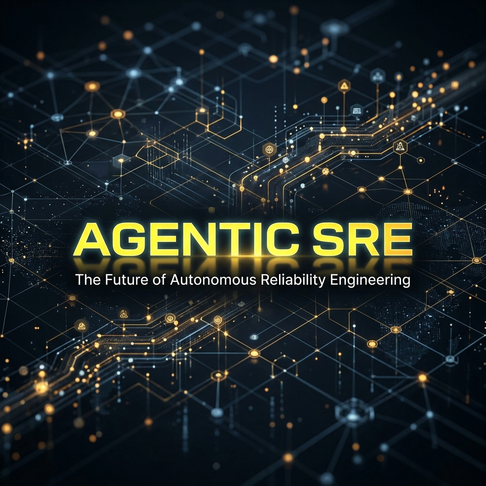
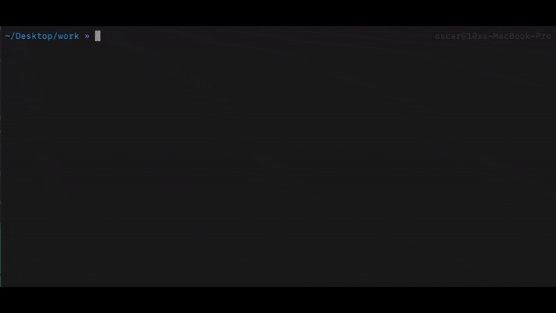
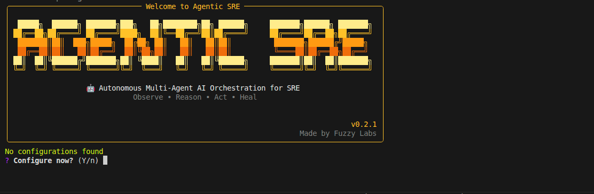
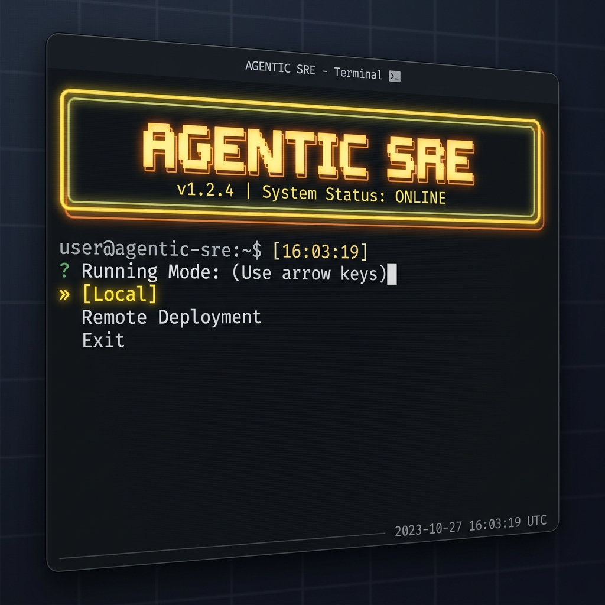
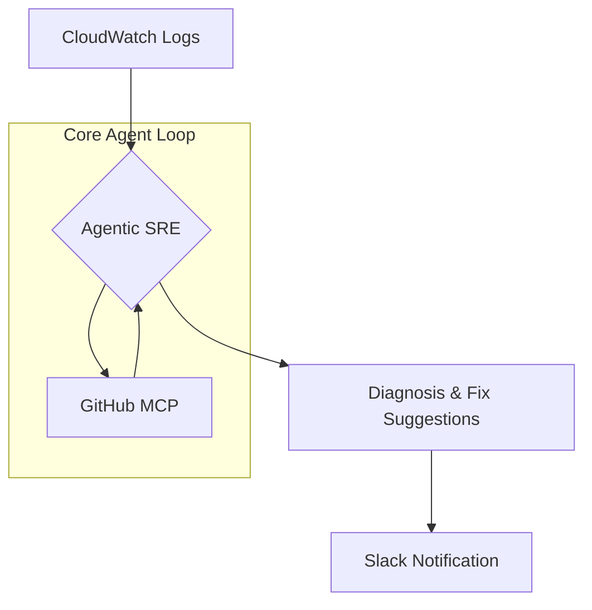

<h1 align="center"> <!-- spellchecker:disable-line -->
    🚀 Agentic SRE 🕵️‍♀️
</h1>

<p align="center">
  
</p>

<p align="center">
    <strong>Flagship Orchestration Engine for the Autonomous Multi-Agent AI Organization</strong>
</p>

Welcome to **Agentic SRE**. This is a premium, open-source multi-agent orchestration engine designed to automate the heavy lifting of Site Reliability Engineering. It coordinates specialized autonomous agents to monitor logs, diagnose production issues, and execute root-cause fixes across distributed systems.

<p align="center"> <!-- spellchecker:disable-line -->
  
</p>

# 🏃 Quick Start

## Prerequisites

- Python 3.13+
- [Docker](https://docs.docker.com/get-docker/) (required for local mode)

## 1️⃣ Install Agentic SRE
```bash
pip install agentic-sre
```

## 2️⃣ Start the CLI
```bash
agentic-sre
```

On first run, the setup wizard will guide you through configuration:



## 3️⃣ Provide the required setup values

The wizard currently asks for:

- `ANTHROPIC_API_KEY`
- `GITHUB_PERSONAL_ACCESS_TOKEN`
- `GITHUB_OWNER`, `GITHUB_REPO`, `GITHUB_REF`
- `SLACK_BOT_TOKEN`, `SLACK_CHANNEL_ID`
- AWS credentials (`AWS_PROFILE` or access keys) and `AWS_REGION`

By default the agent uses `claude-sonnet-4-5-20250929`. You can override this by setting the `MODEL` environment variable.

## 4️⃣ Pick a running mode

After setup, the CLI gives you two modes:

- `Local`: run diagnoses from your machine against a CloudWatch log group.
- `Remote Deployment`: deploy and run the agent on AWS ECS.

Remote mode currently supports AWS ECS only for deploying the agent runtime.

This is the local shell view:



# 🌟 What Does It Do?

Think about a microservice app where any service can fail at any time. **Agentic SRE** watches error logs, identifies which service is affected, checks the configured GitHub repository, diagnoses likely root causes, suggests fixes, and reports back to Slack.

In short, it handles the heavy lifting so your team can focus on fixing the issue quickly.

Your application can run on Kubernetes, ECS, VMs, or elsewhere. The key requirement is that logs are available in CloudWatch.

# 🏛️ Architecture

Agentic SRE operates as a sophisticated state machine, coordinating between logging platforms, source code repositories, and communication channels.



### High-Level Flow

1. **Observe**: Read error logs from CloudWatch.
2. **Reason**: Identify the service and context.
3. **Act**: Inspect source code via the GitHub MCP integration.
4. **Diagnose**: Produce high-fidelity diagnosis and fix suggestions.
5. **Report**: Send results to Slack for human review.


# 🗺️ Integration Roadmap

#### 🧠 Model provider

- [x] Anthropic
- [ ] vLLM
- [ ] OpenAI

#### 🪵 Logging platform

- [x] AWS CloudWatch
- [ ] Google Cloud Observability
- [ ] Azure Monitor

#### 🏢 Remote code repository

- [x] GitHub
- [ ] GitLab
- [ ] Bitbucket

#### 🔔 Notification channel

- [x] Slack
- [ ] Microsoft Teams

#### 🕶️ Remote deployment mode:

- [x] AWS ECS

> [!TIP]
> Looking for a feature or integration that is not listed yet? Open a [Feature / Integration request](https://github.com/DsThakurRawat/Agentic-SRE/issues/new?template=feature_or_integration_request.yml) 🚀

# 🧪 Evaluation

We built a comprehensive evaluation suite to test both tool-use behaviour and diagnosis quality.

- [Evaluation overview](src/agentic_sre/eval/README.md)
- [Tool call evaluation](src/agentic_sre/eval/tool_call/README.md)
- [Diagnosis quality evaluation](src/agentic_sre/eval/diagnosis_quality/README.md)

Run the suites with:

```bash
uv run agentic-sre-run-tool-call-eval
uv run agentic-sre-run-diagnosis-quality-eval
```

# 🤔 Why We Built This

We wanted to learn practical best practices for running AI agents in production: cost, safety, observability, and evaluation. We are sharing the journey in the open and publishing what we learn as we go.

We also write about this work on the [DIVYANSH RAWAT blog](https://www.DsThakurRawat.ai/blog).

> **Contributions welcome.** [Join us](CONTRIBUTING.md) and help shape the future of AI-powered SRE.

# 🔧 For Developers

See [DEVELOPMENT.md](DEVELOPMENT.md) for the full local setup guide.

Install dependencies:

```bash
uv sync --dev
```

Run the interactive CLI locally:

```bash
uv run agentic-sre
```

If you want to run a direct diagnosis without the CLI:

```bash
docker compose up -d slack
uv run python -m agentic_sre.run /aws/containerinsights/no-loafers-for-you/application currencyservice 10
```
