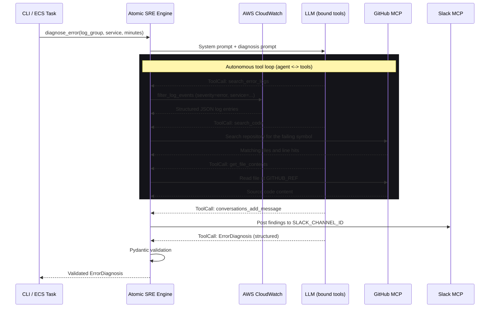
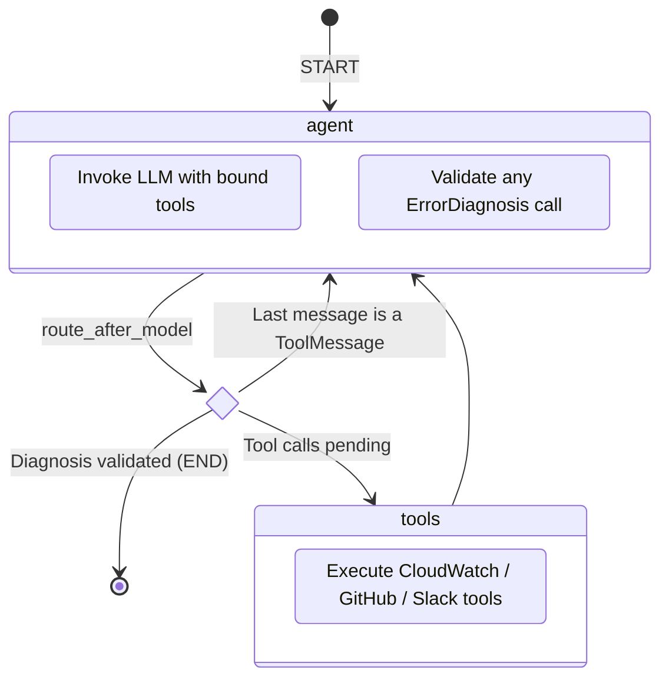

<div align="center"> <!-- spellchecker:disable-line -->

  

  <h1>Atomic SRE</h1>

  <p><b>The Flagship Orchestration Engine for the Autonomous Multi-Agent AI Organisation</b></p>

  <p>
    <a href="https://github.com/DsThakurRawat/Atomic-SRE/actions"></a>
    <a href="https://github.com/DsThakurRawat/Atomic-SRE"></a>
    <a href="https://python.org"></a>
    <a href="LICENSE"></a>
  </p>

</div>

---

> **Atomic SRE** is an open-source, LangGraph-based orchestration engine that automates the heavy lifting of Site Reliability Engineering. It pulls error logs out of CloudWatch, reads the relevant source code straight from GitHub over the Model Context Protocol (MCP), and returns a validated, structured root-cause diagnosis to your Slack channel.

---

## Table of Contents

- [Why Atomic SRE?](#why-atomic-sre)
- [Key Capabilities](#key-capabilities)
- [Quick Start](#quick-start)
  - [Prerequisites](#prerequisites)
  - [Installation](#1-installation)
  - [Launch the CLI](#2-launch-the-cli)
  - [Where configuration lives](#3-where-configuration-lives)
- [Architecture Under the Hood](#architecture-under-the-hood)
  - [Detailed Sequence Flow](#detailed-sequence-flow)
  - [LangGraph State Machine](#langgraph-state-machine)
  - [The Toolset](#the-toolset)
  - [Diagnosis Output](#diagnosis-output)
- [Operational Modes](#operational-modes)
- [Integration Matrix](#integration-matrix)
- [Evaluation & Tracing](#evaluation--tracing)
- [Configuration](#configuration)
- [Project Structure](#project-structure)
- [For Developers](#for-developers)
- [Community & Contributions](#community--contributions)

---

## Why Atomic SRE?

Modern microservice architectures are incredibly resilient, but when they fail, they fail in complex, cascading ways. Traditional observability platforms will alert you that an issue has occurred, and a PagerDuty ping will wake you up at 3 AM. However, the human operator is still left to:

1. Trudge through thousands of log lines to find the relevant error trace.
2. Cross-reference the log's service with the exact commit in the Git repository.
3. Understand the surrounding code context to find the root cause.
4. Formulate and deploy a fix.

**Atomic SRE automates steps 1 through 4.** Given a log group and a service name, it queries the relevant CloudWatch logs, reads the code repository dynamically via the Model Context Protocol (MCP), and drives an LLM reasoning loop until it produces a complete diagnosis with suggested fixes, posted directly to your Slack channel.

You are not just getting an alert; you are getting a review-ready analysis of what broke and why.

---

## Key Capabilities

### Autonomous Diagnosis
Atomic SRE does not just read stack traces; it reasons about them. The CloudWatch toolset filters on `$.log_processed.severity = "error"` and `$.log_processed.service` in your structured JSON logs, so the agent starts from the exact failing component rather than a wall of noise.

### Deep Code Context (Powered by MCP)
Atomic SRE connects to the hosted GitHub MCP server and uses `search_code` and `get_file_contents` to pull the relevant source in real time, exactly as a human developer would when debugging. The repository is never cloned or held in memory.

### Schema-Validated Output
The reasoning loop only terminates when the model emits an `ErrorDiagnosis` tool call that passes Pydantic validation. Malformed output is rejected and fed back to the model as a structured error so it can retry, which means a run either produces a well-formed diagnosis or fails loudly.

### Human-in-the-Loop Alerting
Atomic SRE is designed to augment, not blindly replace, human engineers. Diagnoses are posted to your configured Slack channel through the Slack MCP sidecar for review. No code is committed and no infrastructure is mutated on the agent's own initiative.

---

## Quick Start

### Prerequisites
- **Python 3.12+** (the formatter, linter and Docker image target 3.13)
- **`uv`** for dependency management (the installer script will fetch it for you)
- **Docker** for the Slack MCP sidecar and for the remote deployment mode
- **AWS credentials** with `logs:FilterLogEvents` on the log groups you want to diagnose

### 1. Installation

**Recommended: Direct Installer (via `curl`)**
This script verifies your environment, installs the `uv` package manager, clones the repository, syncs dependencies, and drops an `atomic-sre` wrapper into `~/.local/bin` (adding it to your `PATH` if needed):

```bash
curl -sSL https://raw.githubusercontent.com/DsThakurRawat/Atomic-SRE/main/install.sh | bash
```

**Alternative: Install from source**
Not yet published to PyPI, so install directly from the repository:

```bash
pip install git+https://github.com/DsThakurRawat/Atomic-SRE.git
```

Or clone and sync with `uv`:

```bash
git clone https://github.com/DsThakurRawat/Atomic-SRE.git
cd Atomic-SRE && uv sync --dev
```

### 2. Launch the CLI

For installer or source checkouts:
```bash
cd Atomic-SRE && uv run atomic-sre
```
For `pip` installations (or via the installer's wrapper):
```bash
atomic-sre
```

> **The Setup Wizard**
> On first run, an interactive `questionary` wizard walks you through every required credential and writes them to your user env file. It collects:
> - **Model provider and model**: Anthropic, OpenAI, Groq, Google Gemini, OpenRouter, Ollama, or Amazon Bedrock, with the matching key (`ANTHROPIC_API_KEY`, `OPENAI_API_KEY`, `GROQ_API_KEY`, `GOOGLE_API_KEY`, `OPENROUTER_API_KEY`) or `OLLAMA_HOST`. The default model is `claude-sonnet-4-6`.
> - **GitHub**: `GITHUB_PERSONAL_ACCESS_TOKEN`, `GITHUB_OWNER`, `GITHUB_REPO`, `GITHUB_REF`
> - **Slack**: `SLACK_BOT_TOKEN`, `SLACK_CHANNEL_ID`
> - **AWS**: either `AWS_PROFILE` or `AWS_ACCESS_KEY_ID` / `AWS_SECRET_ACCESS_KEY` (plus optional `AWS_SESSION_TOKEN`), and `AWS_REGION`

<div align="center"> <!-- spellchecker:disable-line -->
  
  <br/>
  
</div>

### 3. Where configuration lives

Settings are **not** read from a `.env` in the repository root. `settings/paths.py` resolves the platform user config directory via `platformdirs`, and every settings class points there:

| Platform | Path |
| :--- | :--- |
| Linux | `~/.config/atomic-sre/.env` and `config.json` |
| macOS | `~/Library/Application Support/atomic-sre/.env` |
| Windows | `%LOCALAPPDATA%\atomic-sre\.env` |

The headless entrypoint (`python -m atomic_sre.run`) calls `load_dotenv` on that same file. If you want a repo-local `.env` to take effect, you must export it into the environment yourself.

---

## Architecture Under the Hood

Atomic SRE is built on **LangGraph** and **LangChain**, using the **Model Context Protocol (MCP)** to fetch source code on demand rather than keeping a repository in context. The reasoning loop is a hand-built `StateGraph`, not a prebuilt ReAct agent, so termination is explicit and validated.

### Detailed Sequence Flow


```mermaid
sequenceDiagram
    participant Trigger as CLI / ECS Task
    participant Engine as Atomic SRE Engine
    participant CW as AWS CloudWatch
    participant LLM as LLM (bound tools)
    participant MCP as GitHub MCP
    participant Slack as Slack MCP

    Trigger->>Engine: diagnose_error(log_group, service, minutes)
    Engine->>LLM: System prompt + diagnosis prompt

    rect rgb(20, 20, 25)
        Note over Engine,MCP: Autonomous tool loop (agent <-> tools)
        LLM-->>Engine: ToolCall: search_error_logs
        Engine->>CW: filter_log_events (severity=error, service=...)
        CW-->>Engine: Structured JSON log entries
        LLM-->>Engine: ToolCall: search_code
        Engine->>MCP: Search repository for the failing symbol
        MCP-->>Engine: Matching files and line hits
        LLM-->>Engine: ToolCall: get_file_contents
        Engine->>MCP: Read file at GITHUB_REF
        MCP-->>Engine: Source code content
    end

    LLM-->>Engine: ToolCall: conversations_add_message
    Engine->>Slack: Post findings to SLACK_CHANNEL_ID
    LLM-->>Engine: ToolCall: ErrorDiagnosis (structured)
    Engine->>Engine: Pydantic validation
    Engine-->>Trigger: Validated ErrorDiagnosis
```

### LangGraph State Machine

The graph compiled in `engine/orchestrator.py` has exactly two nodes, `agent` and `tools`, wired by the `route_after_model` conditional edge. Termination is driven by validation, not by a step counter:


```mermaid
stateDiagram-v2
    [*] --> agent: START

    state agent {
        CallModel: Invoke LLM with bound tools
        Validate: Validate any ErrorDiagnosis call
    }

    state Route <<choice>>
    agent --> Route: route_after_model

    Route --> tools: Tool calls pending
    Route --> agent: Last message is a ToolMessage
    Route --> [*]: Diagnosis validated (END)

    state tools {
        ToolNode: Execute CloudWatch / GitHub / Slack tools
    }

    tools --> agent
```

Validation rules enforced in `_handle_diagnosis_validation`:

- A single `ErrorDiagnosis` call that validates is stashed in `AgentState["diagnosis"]` and routes to `END`.
- A call that fails Pydantic validation is answered with a `ToolMessage` naming the offending fields, so the model can correct itself and retry.
- Multiple concurrent `ErrorDiagnosis` calls in one turn are rejected outright.
- If the graph ends without a valid diagnosis, `diagnose_error` raises `RuntimeError` rather than returning a partial result.

### The Toolset

Tools come from three places and are passed through a strict allowlist in `_filter_mcp_tools`:

| Tool | Source | Purpose |
| :--- | :--- | :--- |
| `search_error_logs` | Direct boto3 (`engine/tools/cloudwatch.py`) | Filter a log group by severity, service, and time window |
| `search_code` | GitHub MCP (`streamable_http`) | Locate the failing symbol across the repository |
| `get_file_contents` | GitHub MCP (`streamable_http`) | Read a specific file at the configured ref |
| `conversations_add_message` | Slack MCP (`sse`, port 13080) | Post findings to the configured channel |
| `ErrorDiagnosis` | Pydantic model bound as a tool | Terminate the loop with a structured result |

Everything else exposed by those MCP servers is filtered out. If the Slack MCP server is unreachable, a fallback `conversations_add_message` tool is registered that logs to the console, so the graph still runs end to end.

### Diagnosis Output

A successful run returns an `ErrorDiagnosis` (`engine/models.py`):

```python
class ErrorDiagnosis(BaseModel):
    summary: str                      # Brief summary of the issue
    root_cause: str                   # Identified root cause
    affected_services: list[str]      # Services affected by this issue
    suggested_fixes: list[SuggestedFix]  # description, file_path, code_snippet
    related_logs: list[str]           # Key log messages related to the issue
    timestamp: datetime               # When the diagnosis was created
```

---

## Operational Modes

The interactive shell (`interfaces/interactive_shell.py`) offers two modes.

### 1. Local Mode
Ideal for testing, debugging, or ad-hoc diagnostics from your machine. You are prompted for a CloudWatch log group, the Slack MCP sidecar is started for you with `docker compose up -d slack`, and `diagnose_error` runs in-process against remote CloudWatch and GitHub.

### 2. Remote Deployment Mode (AWS ECS)
Packages the agent as a container and runs it as a one-off ECS Fargate task. The provisioning code lives under `infrastructure/aws/` and the guided flow runs these steps in order:

1. **Network** (VPC and private subnets)
2. **Security group**
3. **Secrets** (credentials into AWS Secrets Manager)
4. **IAM roles** (task and execution roles)
5. **ECR repositories**
6. **Build and push** the agent image
7. **Task definition**
8. **ECS cluster**

Once deployed, the AWS ECS menu offers **Run diagnosis job**, **Check deployment status**, **Repair deployment**, **Redeploy**, and **Clean up deployment**. Diagnosis inputs are passed as container overrides on a one-off task, and cleanup tears down every resource the CLI created.

### 3. Headless
Bypasses the CLI entirely, which is what you want in CI or for debugging. Positional arguments fall back to the env vars `LOG_GROUP`, `SERVICE_NAME` and `TIME_RANGE_MINUTES`:

```bash
uv run python -m atomic_sre.run <log_group> <service_name> [time_range_minutes]
```

---

## Integration Matrix

Atomic SRE is designed to be extensible. Support is being added across the observability and LLM spectrum.

| Category | Fully Supported | Planned / In Development |
| :--- | :--- | :--- |
| **Model Providers** | Anthropic (Claude), OpenAI, Groq, Google Gemini, Ollama, OpenRouter, AWS Bedrock | vLLM (local inference) |
| **Logging Platforms** | AWS CloudWatch Logs | Google Cloud Observability, Azure Monitor, Datadog |
| **Version Control** | GitHub (via the hosted GitHub MCP server) | GitLab, Bitbucket |
| **Notifications** | Slack (via `korotovsky/slack-mcp-server`) | Microsoft Teams, PagerDuty |
| **Deployment** | AWS ECS (one-off Fargate tasks), local Docker Compose | Kubernetes (Helm charts) |

Model identifiers accept either an explicit `provider:model_id` form (`bedrock:anthropic.claude-...`, `ollama:llama3`, `openrouter:...`) or a bare id whose provider is inferred from the prefix: `claude*` maps to Anthropic, `gpt*`/`o1`/`o3`/`o4` to OpenAI, `gemini*` to Google, and anything else falls back to OpenAI.

*Missing an integration you need for your stack? [Open a feature request here.](https://github.com/DsThakurRawat/Atomic-SRE/issues/new?template=feature_or_integration_request.yml)*

---

## Evaluation & Tracing

LLMs can hallucinate, and in an SRE context hallucinations are dangerous. Atomic SRE ships an automated evaluation suite covering both **tool-use behaviour** and **diagnosis quality**, traced and scored through [Opik](https://github.com/comet-ml/opik). Both suites run against mocked CloudWatch, GitHub, and Slack toolsets, so they need no live infrastructure.

```bash
# Routing: does the agent select and order the right tools?
uv run atomic-sre-run-tool-call-eval

# Diagnostics: is the final root-cause analysis actually correct?
uv run atomic-sre-run-diagnosis-quality-eval
```

Golden datasets live under `src/atomic_sre/benchmarks/{routing,diagnostics}/dataset`. The scoring metrics are:

| Suite | Metrics |
| :--- | :--- |
| Routing | `expected_tool_selection`, `expected_tool_select_order`, `span_tools` |
| Diagnostics | `root_cause_correctness`, `affected_services_match`, `suggested_fixes_quality` |

For detailed metric definitions, see the benchmark docs:
- [Routing & Tool Calls Benchmarks](src/atomic_sre/benchmarks/routing/README.md)
- [Diagnostic Quality Benchmarks](src/atomic_sre/benchmarks/diagnostics/README.md)

---

## Configuration

Beyond the setup wizard, Atomic SRE reads these variables from the user env file (see [Where configuration lives](#3-where-configuration-lives)) or the process environment.

| Variable | Description | Default |
| :--- | :--- | :--- |
| `MODEL` | LLM identifier for the main reasoning loop, bare or `provider:model_id`. | `claude-sonnet-4-6` |
| `ANTHROPIC_API_KEY` | Anthropic API key (Claude models). | *None* |
| `OPENAI_API_KEY` | OpenAI API key. | *None* |
| `GROQ_API_KEY` | Groq API key. | *None* |
| `GOOGLE_API_KEY` | Google API key (Gemini models). | *None* |
| `OPENROUTER_API_KEY` | OpenRouter API key. | *None* |
| `OLLAMA_HOST` | Host URL for a local Ollama instance. | `http://localhost:11434` |
| `AWS_REGION` | Region for CloudWatch and ECS. | `eu-west-2` |
| `AWS_ACCESS_KEY_ID` | AWS access key, if not using a profile. | *None* |
| `AWS_SECRET_ACCESS_KEY` | AWS secret key, if not using a profile. | *None* |
| `AWS_SESSION_TOKEN` | Session token for temporary credentials. | *None* |
| `AWS_PROFILE` | Named AWS profile, used instead of static keys. | *None* |
| `GITHUB_PERSONAL_ACCESS_TOKEN` | **Required.** Bearer token for the GitHub MCP server. | *None* |
| `GITHUB_OWNER` | **Required.** Repository owner. | *None* |
| `GITHUB_REPO` | **Required.** Repository name. | *None* |
| `GITHUB_REF` | **Required.** Branch, tag, or SHA to read code from. | *None* |
| `GITHUB_MCP_URL` | GitHub MCP endpoint. | `https://api.githubcopilot.com/mcp/` |
| `SLACK_BOT_TOKEN` | Bot token consumed by the Slack MCP sidecar. | *None* |
| `SLACK_CHANNEL_ID` | **Required.** Target channel (`Cxxxxxxxxxx`). | *None* |
| `SLACK_MCP_URL` | Slack MCP endpoint. | `http://localhost:13080/sse` |
| `OPIK_API_KEY` | Opik API key for tracing and evaluations. | *None* |
| `OPIK_WORKSPACE` | Optional Opik workspace override. | *None* |

The variables marked **Required** have no defaults. `get_settings()` raises a validation error if they are absent.

### Running with Docker Compose

`docker compose up -d` brings up the agent container together with the Slack MCP sidecar (`ghcr.io/korotovsky/slack-mcp-server`) on port `13080`. Compose reads its values from your shell environment, so export the variables above (or source your env file) before starting it. Start only the sidecar with `docker compose up -d slack`.

---

## Project Structure

```text
Atomic-SRE/
├── docs/imgs/                    # CLI screenshots and banner assets
├── src/atomic_sre/
│   ├── engine/                   # Reasoning core
│   │   ├── orchestrator.py       # LangGraph StateGraph, model routing, MCP loading
│   │   ├── models.py             # ErrorDiagnosis, SuggestedFix, LogEntry, LogQueryResult
│   │   ├── definitions.py        # LoggingInterface / RepositoryInterface / MessagingInterface ABCs
│   │   ├── prompts.py            # System prompt and diagnosis prompt builder
│   │   ├── settings.py           # pydantic-settings config classes
│   │   └── tools/cloudwatch.py   # Direct-API CloudWatch toolset
│   ├── infrastructure/aws/       # ECR, IAM, network, security groups, ECS tasks, secrets, cleanup
│   ├── interfaces/               # CLI surface
│   │   ├── main.py               # Click entrypoint
│   │   ├── interactive_shell.py  # Local / Remote Deployment menu
│   │   ├── setup/                # First-run configuration wizard
│   │   ├── handlers/             # local.py and remote/ (AWS ECS deployment flow)
│   │   └── console/              # Banner, styles, Rich console
│   ├── benchmarks/               # Opik evaluation suites
│   │   ├── routing/              # Tool selection and ordering
│   │   ├── diagnostics/          # Root-cause quality
│   │   └── shared/               # Shared case loader
│   ├── settings/paths.py         # platformdirs-based user config paths
│   └── run.py                    # Headless single-shot entrypoint
├── tests/                        # Pytest suite
├── docker-compose.yaml           # Agent container plus Slack MCP sidecar
├── install.sh                    # Automated curl installer
├── pyproject.toml                # Dependencies and script entrypoints
├── DEVELOPMENT.md                # Developer guide
└── SPEC.md                       # Technical specification
```

---

## For Developers

Fork it, hack on it, improve it. [DEVELOPMENT.md](DEVELOPMENT.md) covers the internals in more depth, and [AGENTS.md](AGENTS.md) records the code conventions (UK English, Python 3.13 syntax, Google-style docstrings, no em dashes).

### Local setup

```bash
git clone https://github.com/DsThakurRawat/Atomic-SRE.git
cd Atomic-SRE
uv sync --dev
uv run atomic-sre          # interactive CLI
```

### Tests and quality gates

```bash
uv run pytest tests                                  # full suite with coverage
uv run pytest tests/test_get_model.py::test_anthropic_provider_resolves   # single test
uv run pre-commit run --all-files                    # ruff, mypy (strict), typos, bandit, trufflehog
```

Mypy runs in strict mode over `src/`. Tests and `docs/` are excluded.

### Adding a new tool or integration

Prefer MCP. Add a `Connection` entry to the `connections` dict in `_load_mcp_tools` and extend the allowlist in `_filter_mcp_tools`, both in `engine/orchestrator.py`:

```python
connections["example"] = {
    "transport": "streamable_http",   # or "sse" / "stdio"
    "url": config.example.mcp_url,
}
```

For a direct-API integration, implement the relevant ABC in `engine/definitions.py` (`LoggingInterface`, `RepositoryInterface`, `MessagingInterface`) and expose `@tool`-decorated callables from a `create_*_toolset(config)` factory, mirroring `engine/tools/cloudwatch.py`.

---

## Community & Contributions

<div align="center"> <!-- spellchecker:disable-line -->
  <p>Built and maintained by <a href="https://github.com/DsThakurRawat">DIVYANSH RAWAT</a>, out of a personal obsession with running AI reliably in production.</p>
  <p>The journey is documented in the open. Read more about the philosophy and technical deep-dives on the <a href="https://www.DsThakurRawat.ai/blog">DIVYANSH RAWAT blog</a>.</p>
  <p><b>Contributions are highly welcomed.</b> Whether it is adding a new logging provider, tweaking the prompts, or fixing a bug, please check the <a href="CONTRIBUTING.md">Contributing Guidelines</a> and open a PR.</p>
</div>
