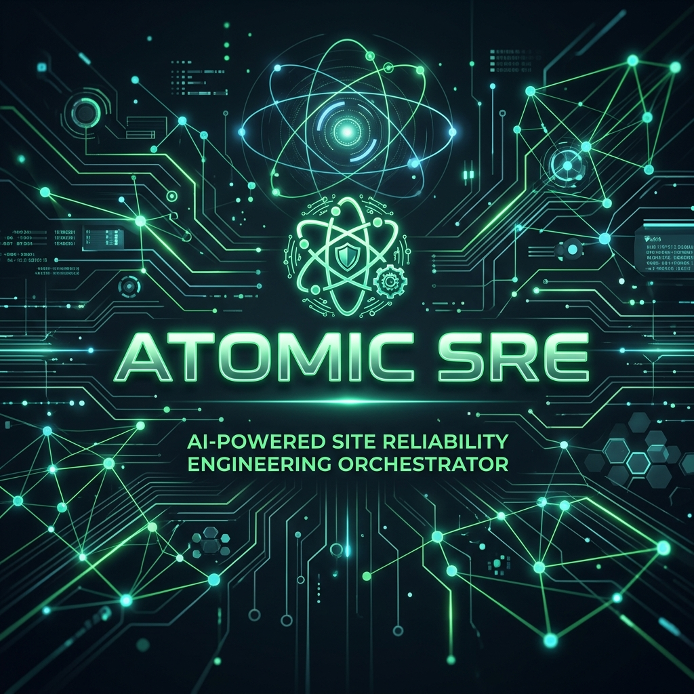
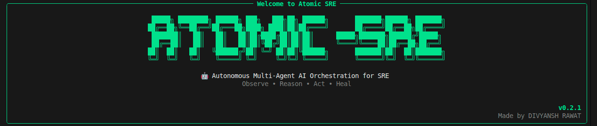
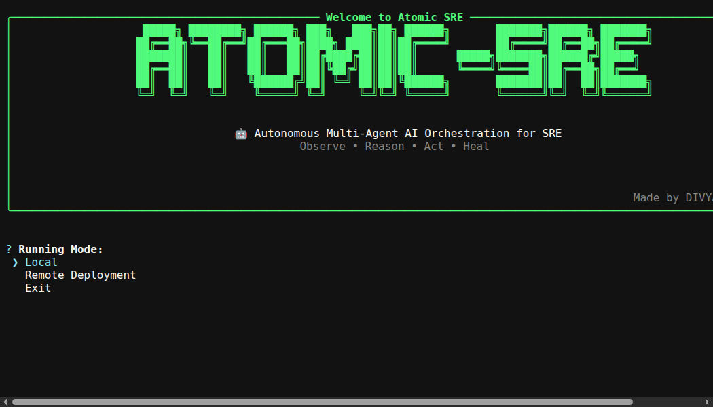
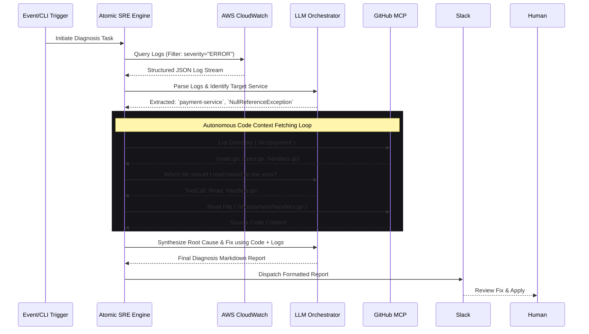
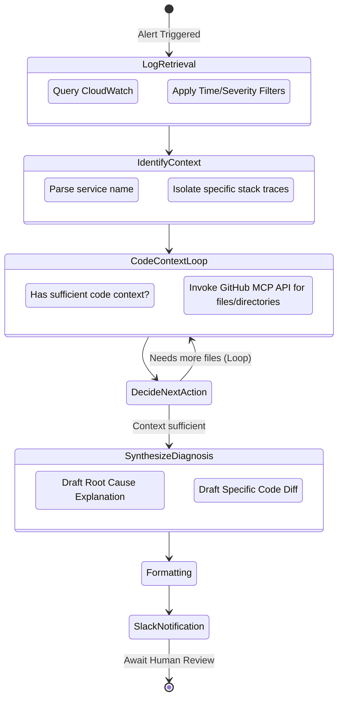

<div align="center">
  
  

  <h1>Atomic SRE</h1>

  <p><b>The Flagship Orchestration Engine for the Autonomous Multi-Agent AI Organisation</b></p>

  <p>
    <a href="https://github.com/DsThakurRawat/Atomic-SRE/actions"></a>
    <a href="https://pypi.org/project/atomic-sre/"></a>
    <a href="https://python.org"></a>
    <a href="LICENSE"></a>
  </p>

</div>

---

> **Atomic SRE** is a premium, open-source multi-agent orchestration engine designed to automate the heavy lifting of Site Reliability Engineering. It coordinates highly specialised autonomous agents to monitor logs, diagnose production issues in real-time, and execute root-cause fixes across distributed systems.

---

## Table of Contents

- [Why Atomic SRE?](#why-atomic-sre)
- [Key Capabilities](#key-capabilities)
- [Quick Start](#quick-start)
  - [Prerequisites](#prerequisites)
  - [Installation](#1-installation)
  - [Launch the CLI](#2-launch-the-cli)
- [Architecture Under the Hood](#architecture-under-the-hood)
  - [Detailed Sequence Flow](#detailed-sequence-flow)
  - [LangGraph State Machine](#langgraph-state-machine)
- [Operational Modes](#operational-modes)
- [Integration Matrix](#integration-matrix)
- [Evaluation & Tracing](#evaluation--tracing)
- [Configuration](#configuration)
- [Project Structure](#project-structure)
- [For Developers](#for-developers)
- [Community & Contributions](#community--contributions)

---

## Why Atomic SRE?

Modern microservice architectures are incredibly resilient, but when they fail, they fail in complex, cascading ways. Traditional observability platforms will alert you that an issue has occurred, and a PagerDuty ping will wake you up at 3 AM. However, the human operator is still left to:

1. Trudge through thousands of log lines to find the relevant error trace.
2. Cross-reference the log's service with the exact commit in the Git repository.
3. Understand the surrounding code context to find the root cause.
4. Formulate and deploy a fix.

**Atomic SRE automates steps 1 through 4.** When an error threshold is breached, Atomic SRE intercepts the alert, securely accesses the relevant logs, reads the code repository dynamically via the Model Context Protocol (MCP), and uses advanced LLM orchestration to provide a complete diagnosis and a suggested fix directly to your Slack channel.

You aren't just getting an alert; you're getting a pull request ready to be merged.

---

## Key Capabilities

### Autonomous Diagnosis
Atomic SRE doesn't just read stack traces; it reasons about them. By extracting `log_processed.severity` and `log_processed.service` dynamically from your structured JSON logs, it maps the exact failing component to its underlying logic, discarding irrelevant noise.

### Deep Code Context (Powered by MCP)
Unlike traditional static analysis tools, Atomic SRE leverages the **Model Context Protocol (MCP)** to securely and dynamically query your GitHub repositories. It fetches directory trees, reads specific file contents, and searches for relevant functions in real-time, exactly as a human developer would when debugging.

### Actionable Insights
The output isn't a vague summary of the error. It's a structured JSON payload or Markdown report containing:
- The exact root cause of the crash.
- A step-by-step reasoning trace.
- A concrete, actionable fix (often with diffs or specific line changes).

### Human-in-the-Loop Alerting
Atomic SRE is designed to augment, not blindly replace, human engineers. All diagnostics, traces, and code suggestions are formatted beautifully and sent directly to your configured Slack channels for review before any action is taken.

---

## Quick Start

### Prerequisites
- **Python 3.12+**
- **Docker** *(required if you intend to run the local Slack simulation or remote deployment modes)*
- **AWS Credentials** *(with `logs:FilterLogEvents` permissions to query CloudWatch logs)*

### 1. Installation

**Recommended: Direct Installer (via `curl`)**
The fastest way to get started. This script automatically verifies your environment, installs the lightning-fast `uv` package manager, clones the Atomic SRE repository, and configures all necessary dependencies:

```bash
curl -sSL https://raw.githubusercontent.com/DsThakurRawat/Atomic-SRE/main/install.sh | bash
```

**Alternative: Pip Installation**
*(Note: Not available on PyPI until the `v0.2.1` tag is officially published. For now, install directly from the repository)*

```bash
pip install git+https://github.com/DsThakurRawat/Atomic-SRE.git
```

### 2. Launch the CLI

For `curl` installations:
```bash
cd Atomic-SRE && uv run atomic-sre
```
For `pip` installations:
```bash
atomic-sre
```

> **The Setup Wizard**
> On your first run, a sleek interactive wizard will guide you through connecting your required API keys. You will need:
> - **LLM Provider API Key**: Provide one of the following based on your preferred model provider: `ANTHROPIC_API_KEY`, `OPENAI_API_KEY`, `GROQ_API_KEY`, `GOOGLE_API_KEY`, or `OPENROUTER_API_KEY`. (The default model identifier is `claude-sonnet-4-6`).
> - `GITHUB_PERSONAL_ACCESS_TOKEN`
> - `GITHUB_OWNER`, `GITHUB_REPO`, `GITHUB_REF`
> - `SLACK_BOT_TOKEN`, `SLACK_CHANNEL_ID`
> - AWS credentials (`AWS_PROFILE` or standard access keys) and `AWS_REGION`

<div align="center">
  
  <br/>
  
</div>

---

## Architecture Under the Hood

Atomic SRE is built on top of state-of-the-art agentic frameworks like **LangGraph** and **LangChain**, utilizing the **Model Context Protocol (MCP)** to dynamically fetch source code without keeping the entire repository in memory.

### Detailed Sequence Flow

The exact lifecycle of a diagnostic run involves deep, continuous back-and-forth between the orchestration engine, the LLM, and your systems:


```mermaid
sequenceDiagram
    participant Trigger as Event/CLI Trigger
    participant Engine as Atomic SRE Engine
    participant CW as AWS CloudWatch
    participant LLM as LLM Orchestrator
    participant MCP as GitHub MCP
    participant Slack as Slack

    Trigger->>Engine: Initiate Diagnosis Task
    Engine->>CW: Query Logs (Filter: severity="ERROR")
    CW-->>Engine: Structured JSON Log Stream
    
    Engine->>LLM: Parse Logs & Identify Target Service
    LLM-->>Engine: Extracted: `payment-service`, `NullReferenceException`
    
    rect rgb(20, 20, 25)
        Note over Engine,MCP: Autonomous Code Context Fetching Loop
        Engine->>MCP: List Directory (`/src/payment`)
        MCP-->>Engine: [main.go, types.go, handlers.go]
        Engine->>LLM: Which file should I read based on the error?
        LLM-->>Engine: ToolCall: Read `handlers.go`
        Engine->>MCP: Read File (`/src/payment/handlers.go`)
        MCP-->>Engine: Source Code Content
    end
    
    Engine->>LLM: Synthesize Root Cause & Fix using Code + Logs
    LLM-->>Engine: Final Diagnosis Markdown Report
    Engine->>Slack: Dispatch Formatted Report
    Slack-->>Human: Review Fix & Apply
```

### LangGraph State Machine

We model the internal reasoning loop as a strict state machine. This ensures that the agent doesn't get stuck in infinite loops and systematically checks for all required context before attempting a diagnosis.


```mermaid
stateDiagram-v2
    [*] --> LogRetrieval: Alert Triggered

    state LogRetrieval {
        FetchLogs: Query CloudWatch
        FilterLogs: Apply Time/Severity Filters
    }
    
    LogRetrieval --> IdentifyContext
    
    state IdentifyContext {
        ExtractService: Parse service name
        ExtractErrors: Isolate specific stack traces
    }

    IdentifyContext --> CodeContextLoop
    
    state CodeContextLoop {
        CheckCache: Has sufficient code context?
        CallMCP: Invoke GitHub MCP API for files/directories
    }
    
    CodeContextLoop --> DecideNextAction
    
    state DecideNextAction <<choice>>
    DecideNextAction --> CodeContextLoop : Needs more files (Loop)
    DecideNextAction --> SynthesizeDiagnosis : Context sufficient

    state SynthesizeDiagnosis {
        DraftRC: Draft Root Cause Explanation
        DraftFix: Draft Specific Code Diff
    }
    
    SynthesizeDiagnosis --> Formatting
    Formatting --> SlackNotification
    SlackNotification --> [*]: Await Human Review
```

---

## Operational Modes

Atomic SRE can be run in two distinct modes depending on your infrastructure needs:

### 1. Local Mode
Ideal for testing, debugging, or running ad-hoc diagnostics from your local machine. In this mode, the CLI runs the LangGraph orchestration locally, querying remote AWS CloudWatch logs and GitHub repositories, and pushing the results to Slack.

### 2. Remote Deployment Mode
Designed for true production SRE automation. The agent runtime is packaged and deployed as an AWS ECS task. It continuously listens for alerts (e.g., via EventBridge or SNS) and runs autonomously in the cloud without requiring a local machine.

---

## Integration Matrix

Atomic SRE is designed to be highly extensible. We are continuously adding support for more providers across the observability and LLM spectrum.

| Category | Fully Supported | Planned / In Development |
| :--- | :--- | :--- |
| **Model Providers** | Anthropic (Claude), OpenAI, Groq, Google Gemini, Ollama, OpenRouter, AWS Bedrock | vLLM (Local inference) |
| **Logging Platforms** | AWS CloudWatch Logs | Google Cloud Observability, Azure Monitor, Datadog |
| **Version Control** | GitHub (via standard API and MCP) | GitLab, Bitbucket |
| **Notifications** | Slack | Microsoft Teams, PagerDuty |
| **Deployment** | AWS ECS (Remote mode), Local Docker | Kubernetes (Helm Charts) |

*Missing an integration you need for your stack? [Open a Feature Request here!](https://github.com/DsThakurRawat/Atomic-SRE/issues/new?template=feature_or_integration_request.yml)*

---

## Evaluation & Tracing

LLMs can hallucinate, and in an SRE context, hallucinations can be dangerous. We believe in **measurable AI**. Atomic SRE includes a comprehensive, automated evaluation suite to test both **tool-use behaviour** and **diagnosis quality**.

By integrating with [Opik](https://github.com/comet-ml/opik), every step of the agent's thought process is captured, traced, and evaluated against golden datasets.

### Running the Benchmark Suites
You can run the internal evaluation suites directly via `uv` to ensure your local changes haven't degraded the agent's reasoning capabilities:

```bash
# Evaluate how accurately the agent selects and uses MCP tools
uv run atomic-sre-run-tool-call-eval

# Evaluate the final quality of the Markdown root-cause analysis
uv run atomic-sre-run-diagnosis-quality-eval
```

For detailed metrics, see the benchmark docs:
- [Routing & Tool Calls Benchmarks](src/atomic_sre/benchmarks/routing/README.md)
- [Diagnostic Quality Benchmarks](src/atomic_sre/benchmarks/diagnostics/README.md)

---

## Configuration

Beyond the initial setup wizard, Atomic SRE can be fine-tuned using environment variables. You can add these to your `.env` file in the project root:

| Variable | Description | Default |
| :--- | :--- | :--- |
| `MODEL` | The specific LLM model identifier to use for the main reasoning loop. | `claude-sonnet-4-6` |
| `ANTHROPIC_API_KEY` | Your Anthropic API key (if using Claude models). | *None* |
| `OPENAI_API_KEY` | Your OpenAI API key (if using OpenAI models). | *None* |
| `GROQ_API_KEY` | Your Groq API key (if using Groq models). | *None* |
| `GOOGLE_API_KEY` | Your Google API key (if using Gemini models). | *None* |
| `OPENROUTER_API_KEY`| Your OpenRouter API key (if using OpenRouter models). | *None* |
| `OLLAMA_HOST` | Host URL for your local Ollama instance. | `http://localhost:11434` |
| `AWS_PROFILE` | Named AWS profile for CloudWatch access. | `default` |
| `AWS_REGION` | The AWS region where your logs reside. | `us-east-1` |
| `OPIK_API_KEY` | Your Opik API key for enabling tracing and evaluations. | *None* |
| `OPIK_WORKSPACE` | Optional override for your Opik workspace name. | *None* |

---

## Project Structure

Here is the folder structure of the `Atomic-SRE` project workspace:

```text
Atomic-SRE/
├── docs/                 # Documentation and visual assets
│   └── imgs/             # CLI screenshots, home banner, and logos
├── src/
│   └── atomic_sre/       # Core package source code
│       ├── cli/          # CLI presentation, configurations, and guided shell
│       ├── config/       # Shared path settings and global configurations
│       ├── core/         # Core agent reasoning logic, model routing, and tool definitions
│       └── eval/         # Evaluation suites for tool calls and diagnosis quality
├── tests/                # Unit test suite
├── pyproject.toml        # Build configuration, script entrypoints, and dependencies
├── install.sh            # Automated curl installation script
├── README.md             # Project overview and quick start guide
└── DEVELOPMENT.md        # Technical developer guide
```

---

## For Developers

We encourage you to fork, hack, and improve Atomic SRE. For a comprehensive breakdown of the internal file structure and development workflows, please read our [DEVELOPMENT.md](DEVELOPMENT.md) guide.

### Basic Local Setup

1. **Clone and Sync Dependencies**:
   ```bash
   git clone https://github.com/DsThakurRawat/Atomic-SRE.git
   cd Atomic-SRE
   uv sync --dev
   ```

2. **Run the Interactive CLI**:
   ```bash
   uv run atomic-sre
   ```

3. **Direct CLI Execution (Headless)**:
   If you want to run a direct diagnosis without the interactive UI (useful for CI/CD or scripting):
   ```bash
   # Ensure Slack simulator or actual Slack config is ready
   docker compose up -d slack

   # Run against a specific log group, service, and timeframe
   uv run python -m atomic_sre.run /aws/containerinsights/production/application my-failing-service 10
   ```

---

## Community & Contributions

<div align="center">
  <p>Built with ❤️ by a team passionate about mastering AI in production environments.</p>
  <p>We are sharing this journey in the open. Read more about the philosophy and technical deep-dives on the <a href="https://www.DsThakurRawat.ai/blog">DIVYANSH RAWAT blog</a>.</p>
  <p><b>Contributions are highly welcomed!</b> Whether it's adding a new logging provider, tweaking the prompts, or fixing a bug, please check out our <a href="CONTRIBUTING.md">Contributing Guidelines</a> and join us in shaping the future of autonomous DevOps.</p>
</div>
